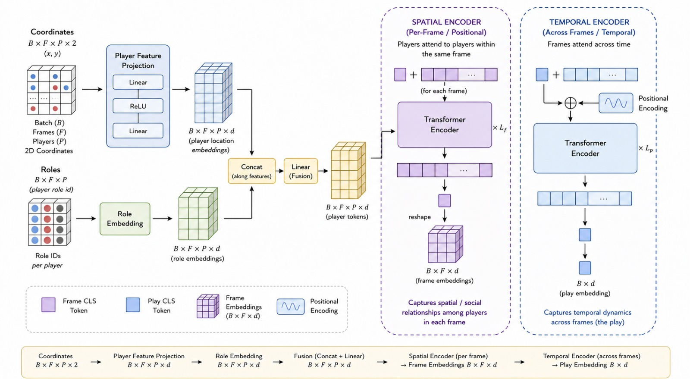

# Football Tactical Retrieval Engine (Ongoing Project)

> **Status:** Active Development / Research Phase
> 
> **Goal:** To build a state-of-the-art, self-supervised Transformer model capable of understanding continuous multi-agent football tracking data to retrieve matching tactical shapes and plays from a vector database.

## Project Overview
This project tackles the complex challenge of spatial-temporal pattern recognition in football (soccer). By processing raw tracking data from the **FIFA World Cup 2022**, the system embeds 10-second sequences of 22 players and the ball into a high-dimensional vector space. 

Instead of relying on rigid grid-based CNNs or manually labeled data, this architecture uses **Continuous Spatial Tokenization** and **Contrastive Learning** to teach a neural network how to inherently understand tactical momentum, team shape, and geometry.

---

---

## 1. Dataset

**Source:** FIFA World Cup 2022 tracking + event data (Second Spectrum format).
Kaggle mirror: [FIFA World Cup 2022 Dataset](https://www.kaggle.com/datasets/mostafa646/fifa-world-cup)

**Raw data per match:**
- `Tracking Data/*.jsonl.bz2` — per-frame (x, y) for all players + ball.
- `Event Data/*.json` — events grouped by `sequence` (a "play").

**Processing (`data/dataTensor.py`):**
1. Each event `sequence` defines a start/end timestamp.
2. All tracking frames inside that window are extracted.
3. Each frame → tensor of shape `(23, 4)`:
   - Rows 0–10: home players, Role = 0
   - Rows 11–21: away players, Role = 1
   - Row 22: ball, Role = 2
   - Columns: `[player_id, x_norm, y_norm, role]` (x normalized by 52.5, y by 34.0 — half-pitch dimensions)
4. Frames stacked → `(T, 23, 4)` tensor per play, saved as one `.pt` file per match (list of plays).

**Dataset class (`data/dataset.py`):**
- Loads `.pt` files for the given match split (train/val/test, defined in `Configs/hier_model_config.yaml`).
- Pads/truncates every play to a fixed `target_frames` (110 frames).
- Returns per sample:
  - `coordinates`: `(F, 23, 2)`
  - `roles`: `(F, 23)`
  - `sequence_id`

No manual labels exist — this is why training is **self-supervised contrastive learning** (see §3).

---

## 2. Model Architecture

**Input:** `coordinates (B, F, P, 2)` + `roles (B, F, P)`, where B=batch, F=frames, P=players(+ball).

**Step 1 — Player Feature Projection**
`Linear → ReLU → Linear` maps each player's (x, y) to a `d`-dim embedding: `(B, F, P, d)`.

**Step 2 — Role Embedding**
A lookup table (`nn.Embedding(3, d)`) maps role id (home/away/ball) to a `d`-dim vector: `(B, F, P, d)`.

**Step 3 — Fusion**
Location and role embeddings are concatenated along the feature dim and projected back to `d` via a `Linear` layer → **player tokens** `(B, F, P, d)`.

**Step 4 — Spatial Encoder (per-frame)**
- For each frame independently, a learnable **Frame CLS** token is prepended to the P player tokens.
- A Transformer Encoder (`L_f` layers) lets players attend to each other *within the same frame only* — no positional encoding, since player order is set/permutation-like, not sequential.
- The output CLS token is taken as the **frame embedding**: `(B, F, d)`. This captures spatial/social structure (formation, marking, spacing) at that instant.

**Step 5 — Temporal Encoder (across frames)**
- The sequence of frame embeddings `(B, F, d)` gets a **Play CLS** token prepended.
- Sinusoidal positional encoding is added (frame order *does* matter here).
- A second Transformer Encoder (`L_p` layers) lets frames attend across time.
- The output CLS token is the final **play embedding** `(B, d)` — a single vector summarizing the whole play's spatio-temporal dynamics.

**Why hierarchical:** decouples "who is near whom right now" (spatial encoder, no time signal) from "how does the shape evolve" (temporal encoder, time-aware). Compare to `Temporal_Baseline_Encoder` (flat per-player temporal attention + mean pooling) and `Transportmer_Baseline` (flattened joint space-time attention) — both simpler baselines without this two-stage separation.

---

## 3. Training

**Config:** `Configs/hier_model_config.yaml`

| Parameter | Value |
|---|---|
| `embed_dim` (d) | 256 |
| `n_heads` | 4 |
| `frame_layers` (L_f) | 2 |
| `play_layers` (L_p) | 2 |
| `batch_size` | 8 |
| `epochs` | 50 |
| `learning_rate` | 1e-4 (AdamW, weight_decay=0.01) |
| `scheduler` | CosineAnnealingLR, `eta_min=1e-6` |
| `clip_max_norm` | 1.0 |
| `temperature` | 0.1 |

**Loss:** NT-Xent (`pytorch_metric_learning.losses.NTXentLoss`) — standard contrastive loss (SimCLR-style). For every anchor embedding, its true positive pair is pulled close while all other embeddings in the batch are pushed apart, scaled by `temperature`.

**Ground truth generation — no labels needed:**
Since there's no human annotation of "play type" or similarity, positive pairs are created via **augmentation**, not labels:
1. Each play is loaded at 110 frames.
2. `augment_play_temporal()` slices two overlapping 100-frame views:
   - View 1: frames `0–100`
   - View 2: frames `10–110`
3. Both views pass through the *same* model → `proj_1`, `proj_2`.
4. They are each other's positive pair (same play, slightly time-shifted); all other plays in the batch are negatives.
5. `labels = arange(batch_size).repeat(2)` ties `proj_1[i]` to `proj_2[i]`.